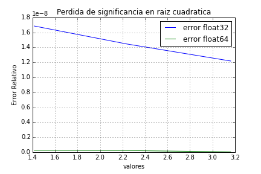

#  MCOC-Proyecto-0
Proyecto 0 para Métodos Computaciones de obras civiles

 
Introducción
=============
En este código se verá cómo afecta el float32 y float64 dentro de un código, ejemplificando así la perdida por significancia.

 
Ejemplo
========
Para este código se usaron 3 números; 2, 5 y 10. De estos se sacó la raíz cuadratica con calculadora primero, dejando estos como raíces exactas, luego se calculó cada raíz vinculados al float32 y float64. A partir de esto se midió el error y luego se comparó en un gráfico.


Resultados
==========
Resultados del programa:
```
valores exactos: [1.414213562, 2.236067978, 3.16227766]
valores float32 [1.4142135, 2.236068, 3.1622777]
error de float32 [1.6850453026039418e-08, 1.4458505113789782e-08, 1.2180096074446877e-08]
valors float64 [1.4142135623730951, 2.2360679774997898, 3.1622776601683795]
error de float64 [2.638180826341045e-10, 2.2370075529360522e-10, 5.3246283420640616e-11]
```
el siguiente gráfico representa el error de cada uno.



Recursos
========
https://github.com/jaabell/MCOC-Proyecto-0

https://en.wikipedia.org/wiki/Loss_of_significance
https://www.youtube.com/watch?v=PZRI1IfStY0&feature=youtu.be
